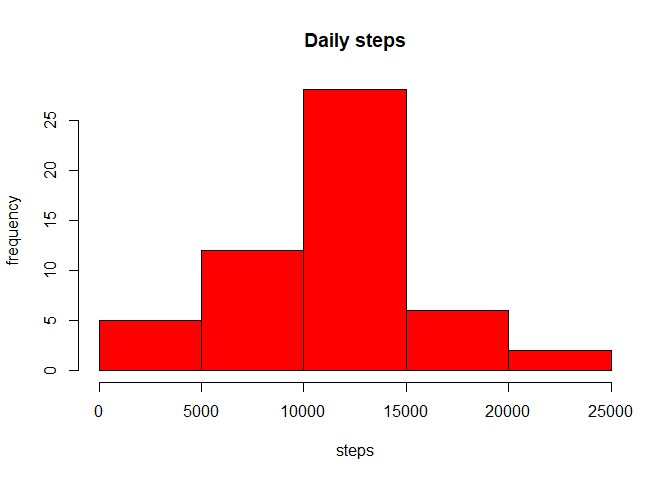

## Introduction
It is now possible to collect a large amount of data about personal movement using activity monitoring devices such as a Fitbit, Nike Fuelband, or Jawbone Up. These type of devices are part of the “quantified self” movement – a group of enthusiasts who take measurements about themselves regularly to improve their health, to find patterns in their behavior, or because they are tech geeks. But these data remain under-utilized both because the raw data are hard to obtain and there is a lack of statistical methods and software for processing and interpreting the data.
This assignment makes use of data from a personal activity monitoring device. This device collects data at 5 minute intervals through out the day. The data consists of two months of data from an anonymous individual collected during the months of October and November, 2012 and include the number of steps taken in 5 minute intervals each day.

The data for this assignment can be downloaded from the course web site:

* Dataset: [Activity monitoring data](https://d396qusza40orc.cloudfront.net/repdata%2Fdata%2Factivity.zip) 

The variables included in this dataset are:

steps: Number of steps taking in a 5-minute interval (missing values are coded as NA)
date: The date on which the measurement was taken in YYYY-MM-DD format  
interval: Identifier for the 5-minute interval in which measurement was taken  
The dataset is stored in a comma-separated-value (CSV) file and there are a total of 17,568 observations in this dataset

## Loading and preprocessing the data
Unzip data to obtain a csv file.

```r
library("data.table")
library(ggplot2)
fileUrl <- "https://d396qusza40orc.cloudfront.net/repdata%2Fdata%2Factivity.zip"
download.file(fileUrl, destfile = paste0(getwd(), '/repdata%2Fdata%2Factivity.zip'), method = "curl")
unzip("repdata%2Fdata%2Factivity.zip",exdir = "data")
```
## Reading csv Data into variable.

```r
acv <- read.csv("data/activity.csv")
acv <- data.frame(acv)
```
## Histogram of the total number of steps taken each day

```r
library(dplyr)
```

```
## 
## Attaching package: 'dplyr'
```

```
## The following objects are masked from 'package:data.table':
## 
##     between, first, last
```

```
## The following objects are masked from 'package:stats':
## 
##     filter, lag
```

```
## The following objects are masked from 'package:base':
## 
##     intersect, setdiff, setequal, union
```

```r
library(reshape2)
```

```
## 
## Attaching package: 'reshape2'
```

```
## The following objects are masked from 'package:data.table':
## 
##     dcast, melt
```

```r
acv <- arrange(acv,date)
acv1 <- tapply(acv$steps,acv$date,sum)
acv1 <-melt(acv1)
acv1 <-setNames(acv1,c("dates","steps"))
head(acv1)
```

       dates steps
1 2012-10-01    NA
2 2012-10-02   126
3 2012-10-03 11352
4 2012-10-04 12116
5 2012-10-05 13294
6 2012-10-06 15420

```r
with(acv1,hist(steps,xlab="steps",ylab="frequency",main="Daily steps",col="red"))
```

<!-- -->

## Mean and median number of steps taken each day

```r
acv1 <- data.table(acv1)
acv1[, .(Mean_Steps = mean(steps, na.rm = TRUE), Median_Steps = median(steps, na.rm = TRUE))]
```

   Mean_Steps Median_Steps
1:   10766.19        10765
## Time series plot of the average number of steps taken

```r
acv <- arrange(acv,interval)
acv2 <- tapply(acv$steps,acv$interval,mean,na.rm=TRUE)
acv2 <-melt(acv2)
acv2 <-setNames(acv2,c("interval","steps"))
with(acv2,plot(interval,steps,type="l",xlab="interval",ylab="avg steps",ylim=c(0,200),main="average daliy steps"))
```

<!-- -->

## The 5-minute interval that, on average, contains the maximum number of steps

```r
acv2 <- data.table(acv2)
acv2[steps == max(steps), .(max_interval = interval)]
```

```
##    max_interval
## 1:          835
```
## (1)Code to describe and show a strategy for imputing missing data

```r
acv_1 <- read.csv("data/activity.csv")
acv_1 <- data.table(acv)
acv_1[is.na(steps), .N ]
```

```
## [1] 2304
```
### (1.1)Devise a strategy for filling in all of the missing values in the dataset. The strategy does not need to be sophisticated. For example, you could use the mean/median for that day, or the mean for that 5-minute interval, etc.

```r
acv_1[is.na(steps), "steps"] <- acv_1[, c(lapply(.SD, median, na.rm = TRUE)), .SDcols = c("steps")]
head(acv_1)
```

```
##    steps       date interval
## 1:     0 2012-10-01        0
## 2:     0 2012-10-02        0
## 3:     0 2012-10-03        0
## 4:    47 2012-10-04        0
## 5:     0 2012-10-05        0
## 6:     0 2012-10-06        0
```
### (1.2)Create a new dataset that is equal to the original dataset but with the missing data filled in.

```r
fwrite(x = acv_1, file = "data/tidyData.csv", quote = FALSE)
```
### (1.3)Make a histogram of the total number of steps taken each day and calculate and report the mean and median total number of steps taken per day. Do these values differ from the estimates from the first part of the assignment? What is the impact of imputing missing data on the estimates of the total daily number of steps?

```r
acv_1 <- arrange(acv_1,date)
acv3 <- tapply(acv_1$steps,acv_1$date,sum)
acv3 <- melt(acv3)
acv3 <- setNames(acv3,c("date","steps"))
acv3 <- data.table(acv3)
acv3[, .(Mean_Steps = mean(steps), Median_Steps = median(steps))]
```

   Mean_Steps Median_Steps
1:    9354.23        10395

```r
with(acv3,hist(steps,xlab="steps",ylab="frequency",main="Daily steps",col="red"))
```

<!-- -->

## Type of Estimate | Mean_Steps | Median_Steps

## First Part (with na) | 10765 | 10765

## Second Part (fillin in na with median) | 9354.23 | 10395

## Panel plot comparing the average number of steps taken per 5-minute interval across weekdays and weekends

```r
acv_2 <- data.table::fread(input = "data/activity.csv")
acv_2[, date := as.POSIXct(date, format = "%Y-%m-%d")]
acv_2[, `DayofWeek`:= weekdays(x = date)]
acv_2[grepl(pattern = "Monday|Tuesday|Wednesday|Thursday|Friday", x = `DayofWeek`), "weekdayorweekend"] <- "weekday"
acv_2[grepl(pattern = "Saturday|Sunday", x = `DayofWeek`), "weekdayorweekend"] <- "weekend"
acv_2[, `weekdayorweekend` := as.factor(`weekdayorweekend`)]
head(acv_2, 10)
```

```
##     steps       date interval DayofWeek weekdayorweekend
##  1:    NA 2012-10-01        0    Monday          weekday
##  2:    NA 2012-10-01        5    Monday          weekday
##  3:    NA 2012-10-01       10    Monday          weekday
##  4:    NA 2012-10-01       15    Monday          weekday
##  5:    NA 2012-10-01       20    Monday          weekday
##  6:    NA 2012-10-01       25    Monday          weekday
##  7:    NA 2012-10-01       30    Monday          weekday
##  8:    NA 2012-10-01       35    Monday          weekday
##  9:    NA 2012-10-01       40    Monday          weekday
## 10:    NA 2012-10-01       45    Monday          weekday
```

## making the plot

```r
acv_2[is.na(steps), "steps"] <- acv_2[, c(lapply(.SD, median, na.rm = TRUE)), .SDcols = c("steps")]
acv4 <- acv_2[, c(lapply(.SD, mean, na.rm = TRUE)), .SDcols = c("steps"), by = .(interval, `weekdayorweekend`)] 

ggplot(acv4, aes(x = interval , y = steps, color=`weekdayorweekend`)) + geom_line() + labs(title = "Avg. Daily Steps by Weektype", x = "Interval", y = "No. of Steps") + facet_wrap(`weekdayorweekend`~. , ncol = 2, nrow=1)
```

<!-- -->


